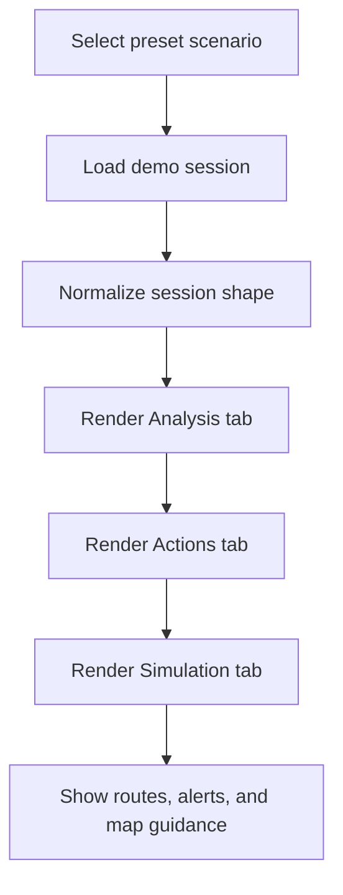
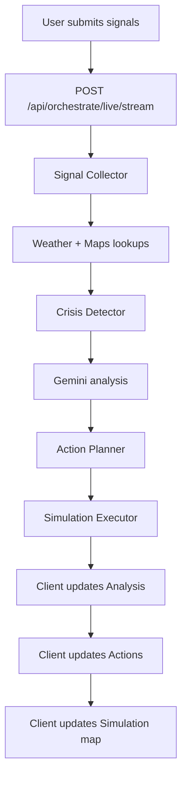
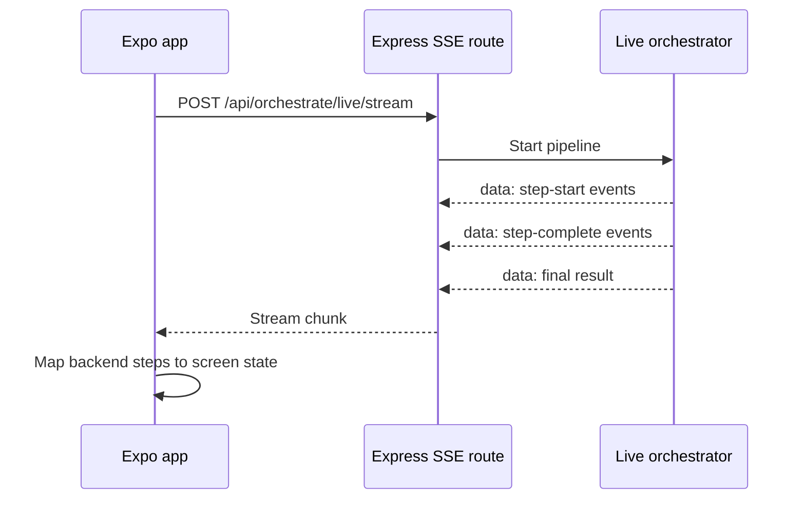
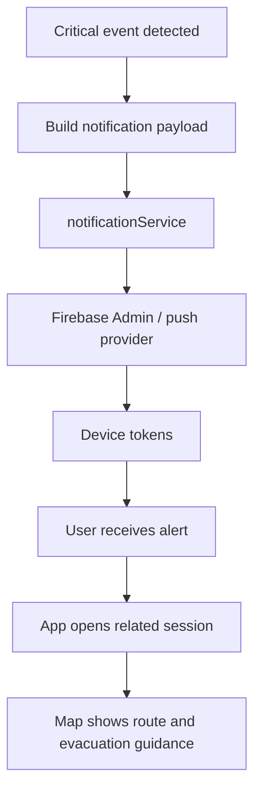
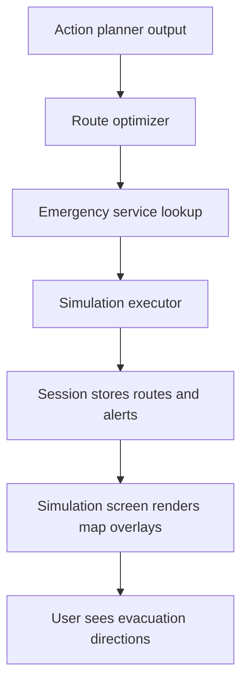
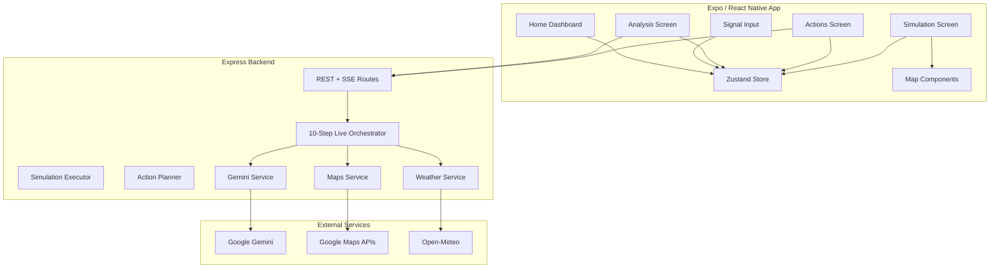

# CIRO: Crisis Intelligence & Response Orchestrator

CIRO is a crisis intelligence platform built with Expo, React Native, Zustand, Express, Google Maps services, and Google Gemini. It turns raw emergency reports into a guided response flow with live analysis, route planning, map visualization, and simulation outcomes.

You can run it in two ways:

- Demo mode for offline walkthroughs with preset scenarios.
- Live mode for a streamed 10-step orchestration pipeline powered by backend services.

## Quick Start

If you only want the fastest path:

1. Install dependencies.
2. Start the backend on port `3000`.
3. Start Expo.
4. Open the Input screen and load a preset scenario.
5. Review Analysis, Actions, and Simulation in sequence.

## Choose Your Path

### Demo Walkthrough

Use this when you want a reliable, presentation-ready flow.

1. Open the Home tab.
2. Toggle Demo mode if it is not already enabled.
3. Pick a scenario from Quick Scenario Simulation.
4. The Input tab is prefilled with signals and location.
5. The Analysis tab shows the 5-step visual pipeline and a generated summary.
6. The Actions tab shows the response plan.
7. The Simulation tab shows routes, alerts, tickets, logs, and map guidance.

### Live Analysis

Use this when you want the backend to fetch and synthesize real telemetry.

1. Enter or load signals in the Input tab.
2. Keep Demo mode off.
3. Start analysis.
4. Watch the SSE-backed pipeline stream through the Analysis tab.
5. Open Actions to simulate the plan.
6. Open Simulation to inspect evacuation routes and outcomes.

## What The App Does

- Ingests social, weather, and traffic signals.
- Detects the likely crisis type and severity.
- Generates response actions for emergency services, traffic control, alerts, and resources.
- Simulates the effect of the response plan.
- Renders evacuation and reroute guidance on maps.
- Shows recent sessions and crisis markers on the home dashboard.

## Screen Guide

### Home

The home dashboard is the control room. It shows live status, demo state, quick scenario cards, and a map that marks preset scenarios and recent sessions.

### Input

This is where you enter a location and signal data or load a preset scenario. It is the start of both demo and live workflows.

### Analysis

This screen visualizes the pipeline. In demo mode it uses the precomputed scenario result; in live mode it listens to the backend stream and displays each stage as it completes.

### Actions

This screen shows the response plan. You can mark actions as simulated, dismiss them, or run the full simulation.

### Simulation

This screen shows the route map, blocked corridor, emergency service locations, alert output, dispatch tickets, and execution logs.

## Demo vs Live Workflows

### Demo Workflow

Demo mode is deterministic and safe for offline walkthroughs.

1. A preset scenario is loaded from `lib/mock/scenarios.ts`.
2. The app normalizes the preset session into the shared session shape.
3. The Analysis tab renders the precomputed session and summary.
4. The Actions tab shows the preset action list.
5. The Simulation tab shows the preset outcome, logs, and routes.

### Live Workflow

Live mode uses the backend orchestration flow.

1. The client posts signals to `/api/orchestrate/live/stream`.
2. The backend streams step events while resolving weather, maps, AI analysis, and emergency services.
3. The action planner produces a prioritized response plan.
4. The simulation executor evaluates route and response outcomes.
5. The client renders the final result on the map and in the session summary.

## Workflow Diagrams

### Demo Scenario Flow



### Live Orchestration Flow



### SSE Update Lifecycle



### Notification Delivery Flow



### Response Plan To Map Flow



## 10-Step Live Agent Pipeline

The live backend pipeline is implemented in `server/agents/orchestrator.js`.

1. Signal Collector - normalizes raw social and telemetry inputs.
2. Weather Fetcher - retrieves weather data and flood or heat risk signals.
3. Maps Fetcher - queries traffic conditions and route options.
4. Crisis Detector - classifies the likely crisis and confidence.
5. Gemini Analyst - generates a richer incident narrative.
6. Situation Analyst - synthesizes severity, explanation, and impact.
7. Action Planner - creates prioritized response actions.
8. Maps Route Optimizer - identifies bypass and evacuation corridors.
9. Emergency Services Locator - finds hospitals, police, and fire stations.
10. Simulation Executor - evaluates the mitigation outcome.

The app still keeps a simplified 5-step visual pipeline for demo presentation, but the live backend is the full 10-step flow.

## Interactive Examples

### Example 1: Urban Flooding Demo

1. Load the G-10 flooding scenario on the Home tab.
2. Open Input and confirm the social reports and heavy rain signal.
3. Open Analysis and inspect the crisis summary.
4. Open Actions to review rescue, diversion, alert, and resource tasks.
5. Open Simulation to inspect blocked roads, bypass routes, and outcome reduction.

### Example 2: Road Accident Demo

1. Load the Faizabad scenario.
2. Review the actions assigned to emergency and traffic control.
3. Open Simulation to compare alternate routes and responder locations.

### Example 3: Live Crisis Run

1. Turn Demo mode off.
2. Enter location and live signals.
3. Start analysis and wait for the stream.
4. When the session completes, jump from Analysis to Actions to Simulation.

## System Architecture



## Tech Stack

### Mobile

- Expo 54
- React Native 0.81
- Expo Router
- Zustand
- React Native Maps
- React Native Gesture Handler
- Expo Notifications
- TanStack Query

### Backend

- Node.js
- Express
- SSE for streaming pipeline updates
- Google Generative AI SDK
- Google Maps Services SDK
- Open-Meteo integration
- Firebase Admin for notifications

## Data Model Notes

- Demo and live sessions are normalized to support `routes` and `simulatedRoutes`.
- Alerts are read from both `alerts` and `sentAlerts`.
- Logs are read from both `logs` and `systemLogs`.
- The home map shows both preset scenario markers and recent session markers.
- The simulation map shows evacuation guidance, not just summary text.

## Setup Guide

### Prerequisites

- Node.js 18 or newer
- npm
- Android emulator, iOS simulator, or a physical device with Expo Go
- Google Maps API key for live routing and places
- Gemini API key for live AI responses

### Install Dependencies

From the project root:

```bash
npm install
cd server
npm install
cd ..
```

### Environment Variables

Create a root `.env` file:

```env
EXPO_PUBLIC_API_BASE_URL=http://localhost:3000
EXPO_PUBLIC_GOOGLE_MAPS_API_KEY=your_google_maps_key
EXPO_PUBLIC_GEMINI_API_KEY=your_gemini_key
```

Create `server/.env`:

```env
PORT=3000
GEMINI_API_KEY=your_gemini_key
GOOGLE_MAPS_API_KEY=your_google_maps_key
```

If you use a physical phone, replace `localhost` with your computer's LAN IP.

### Run The App

Backend:

```bash
npm run server
```

Expo:

```bash
npm start
```

Both together:

```bash
npm run dev
```

## API Routes

### Health

- `GET /api/health`

### Weather

- `GET /api/weather/:location`
- `GET /api/mock/weather`

### Maps

- `GET /api/maps/routes`
- `GET /api/maps/traffic/:location`
- `GET /api/maps/emergency-services/:type`
- `POST /api/maps/geocode`
- `GET /api/maps/reverse-geocode`

### Gemini

- `POST /api/gemini/analyze`
- `GET /api/gemini/stream`
- `POST /api/gemini/action-plan`
- `POST /api/gemini/evaluate`

### Agent Simulation

- `POST /api/agent/detect`
- `POST /api/agent/analyze`
- `POST /api/agent/plan`
- `POST /api/agent/simulate`

### Full Orchestration

- `POST /api/orchestrate`
- `POST /api/orchestrate/live`
- `POST /api/orchestrate/live/stream`

## Troubleshooting

### Analysis Screen Stays Empty

- Make sure a scenario is loaded or signals are present.
- Confirm Demo mode matches the type of session you are opening.
- Verify the backend URL is correct.

### Actions Screen Keeps Loading

- Check that the backend is running on port `3000`.
- Confirm `EXPO_PUBLIC_API_BASE_URL` points to the right host.
- Make sure the session contains actions.

### Maps Do Not Render

- Ensure `react-native-maps` is installed.
- Add a valid Google Maps API key for live map support.
- On web, a fallback visualization is used instead of native maps.

### Live SSE Does Not Stream

- Confirm `/api/orchestrate/live/stream` is reachable.
- Check the backend terminal for API or key errors.
- Use live mode only when the backend environment variables are set.

## Notes

- Demo mode is deterministic and presentation-friendly.
- Live mode depends on external APIs and environment variables.
- The response plan, evacuation routing, and simulation outcome are intended to be visible on the map and in the session summary.
