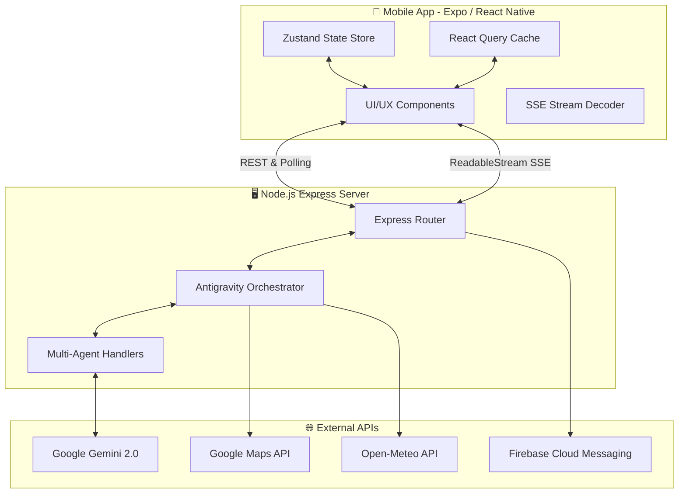
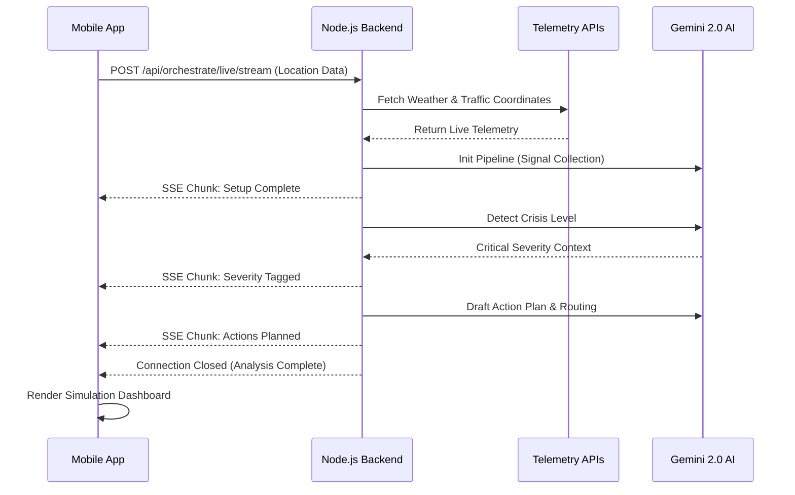

# 🌪️ CIRO: Crisis Intelligence & Response Orchestrator


CIRO is a state-of-the-art, real-time crisis tracking, predictive simulation, and incident response platform. Powered by **Google Gemini 2.0 Flash** and the custom **Antigravity Orchestrator**, CIRO unifies multi-source environmental telemetry (weather, mapped infrastructure, traffic) into a cohesive dashboard. It provides authorities and civilian users with live situational awareness, multi-agent AI pipeline analysis, automated optimal rerouting, and real-time push notification broadcasting.

---

## 📑 Table of Contents

1. [System Architecture](#-system-architecture)
2. [Core Workflows & Diagrams](#-core-workflows--diagrams)
3. [Features & Capabilities](#-features--capabilities)
4. [Technology Stack](#-technology-stack)
5. [Project Structure Mapping](#-project-structure-mapping)
6. [Comprehensive Setup Guide](#-comprehensive-setup-guide)
7. [API & Services Reference](#-api--services-reference)
8. [Troubleshooting Guide](#-troubleshooting-guide)

---

## 🏗️ System Architecture

CIRO is decoupled into two primary monolithic structures: the **Mobile Client** and the **AI Orchestration Server**.



---

## 🔄 Core Workflows & Diagrams

### 1. Data Ingestion & Live Analysis Pipeline
When a user launches a crisis analysis, CIRO triggers the Antigravity Orchestrator. This process utilizes Server-Sent Events (SSE) to stream reasoning steps chunk-by-chunk to the user interface, preventing long blocking loaders.



### 2. Live Simulation & Mitigation
After analysis, the application generates a real-world simulation to demonstrate mitigation tactics.

* **Blocked Route Mapping**: Queries Maps Directions API to find traffic saturation based on the AI's blocked roads.
* **Alternate Route Mapping**: Renders safe routes away from crisis epicenters.
* **Emergency Services Dispatch**: Connects with Google Places API to plot actual nearby hospitals, fire brigades, and police stations.

---

## ✨ Features & Capabilities

* **Live Dashboard Environment Hub**: Built with React Query to auto-poll API health statuses, live regional weather warnings, and active crisis feeds every 5 minutes.
* **Antigravity AI Orchestrator**: A 10-step multi-agent architecture passing context seamlessly:
  `Signal Collector -> Situation Analyst -> Crisis Detector -> Action Planner -> Simulation Executor`
* **Real-time SSE Decoding**: Streams massive LLM generation blocks smoothly into beautifully staggered React Native `Animated.spring` cards.
* **Geospatial Intelligence**: Employs `react-native-maps` to draw highly specific polylines contrasting dangerous routes vs. safe evacuation routes.

---

## 💻 Technology Stack

### Mobile Frontend
- **Framework**: React Native, Expo, Expo Router
- **State Management**: Zustand (Global Store), React Query (Server caching & polling)
- **Mapping**: `react-native-maps`, Google Directions & Places
- **Styling**: Custom Design System, React Native Animated API

### Backend Server
- **Runtime**: Node.js, Express.js
- **Streaming Protocol**: HTTP Server-Sent Events (SSE)
- **AI Integration**: `@google/genai` (Gemini 2.0 Flash)
- **External Services**: Axios, Firebase Admin SDK

---

## 📁 Project Structure Mapping

```text
CIRO/
├── app/                        # Expo Router Pages
│   ├── _layout.tsx             # Root layout & QueryClientProvider
│   └── (tabs)/                 # Main Bottom Tab Navigation
│       ├── index.tsx           # Home Live Dashboard
│       ├── input.tsx           # Crisis Data Entry Screen
│       ├── analysis.tsx        # SSE Streaming Pipeline Screen
│       └── simulation.tsx      # Routing & Evaluation Map Screen
├── components/                 # Reusable UI Blocks
│   ├── agents/                 # Pipeline Visualizers
│   ├── maps/                   # Polyline and Marker Handlers
│   ├── simulation/             # Live Route Comparison UI
│   ├── ui/                     # Badges, Buttons, Cards, Status Dots
│   └── weather/                # LiveWeatherCard & Rain Animations
├── constants/                  # Colors, Layouts, Prompts
├── lib/                        # Core Utilities
│   ├── api/                    # Axios/Fetch clients
│   ├── store/                  # Zustand 'useAppStore.ts'
│   └── notifications.ts        # Expo/Firebase Push Handlers
└── server/                     # Node.js Backend Source
    ├── agents/                 # Antigravity Step Definitions
    ├── config/                 # Service key mappings
    ├── services/               # Adapters for Maps, Gemini, Weather
    └── server.js               # Entry point
```

---

## 🚀 Comprehensive Setup Guide

### Phase 1: Prerequisites
Ensure you have the following installed on your machine:
*   [Node.js](https://nodejs.org/en/) (v18.0 or higher)
*   [Git](https://git-scm.com/)
*   [Expo CLI](https://docs.expo.dev/get-started/installation/) (`npm install -g expo-cli`)
*   iOS Simulator (via Xcode) or Android Emulator (via Android Studio), OR a physical device with the **Expo Go** application installed.

### Phase 2: Repository Cloning & Dependencies
```bash
# Clone the repository
git clone https://github.com/your-org/ciro-platform.git
cd ciro-platform

# Install root (Frontend) dependencies
npm install

# Install backend dependencies
cd server
npm install
cd ..
```

### Phase 3: Environment Setup
CIRO requires dual environment configurations.

**1. Create a `.env` in the Project Root (Frontend Variables):**
```env
EXPO_PUBLIC_API_BASE_URL=http://192.168.X.X:3000   # Use your machine's local IP for Expo Go!
EXPO_PUBLIC_GEMINI_API_KEY=your_gemini_2.0_key
EXPO_PUBLIC_GOOGLE_MAPS_API_KEY=your_maps_key
```

**2. Create a `.env` in the `/server` directory (Backend Variables):**
```env
PORT=3000
GEMINI_API_KEY=your_gemini_2.0_key
GOOGLE_MAPS_API_KEY=your_maps_key
OPEN_METEO_BASE_URL=https://api.open-meteo.com/v1/forecast
# FIREBASE_SERVICE_ACCOUNT_PATH=./config/serviceAccountKey.json # Optional for FCM
```

### Phase 4: Boot Sequence

**Start the Backend Server:**
```bash
# Open a new terminal window
cd server
npm start
# Expected Output: "CIRO Engine running on port 3000"
```

**Start the Mobile Application:**
```bash
# Open a new terminal window in root
npx expo start
```
*Press `i` in the terminal to open iOS emulator, `a` for Android, or scan the QR code with your phone via Expo Go.*

---

## 🔌 API & Services Reference

The Node.js server exposes several utilities:

| Endpoint | Method | Purpose |
| :--- | :--- | :--- |
| `/api/health` | `GET` | Polled by React Query. Checks Gemini, Maps, and Weather uptime. |
| `/api/orchestrate/live/stream`| `POST` | Core SSE endpoint. Ingests crisis payload, returns text/event-stream chunks representing the AI multi-agent 10-step progress. |
| `/api/weather/live` | `GET` | Proxies the Open-Meteo API returning formatted degrees/flood-risks. |
| `/api/gemini/evaluate` | `POST` | Returns a strict JSON assessment and realism score based on a simulated action outcome. |

---

## 🛠️ Troubleshooting Guide

**1. Network Errors / Network Request Failed (Expo):**
*   **Cause**: Expo cannot route `localhost` from a physical device.
*   **Fix**: Update `EXPO_PUBLIC_API_BASE_URL` to your computer's local Wi-Fi IP address (e.g., `http://192.168.1.55:3000`).

**2. Missing Maps / Blank Grey Squares:**
*   **Cause**: Invalid or restricted Google Maps API Key.
*   **Fix**: Ensure your Maps API Key has "Maps SDK for Android/iOS", "Places API", and "Directions API" enabled in Google Cloud Console.

**3. Stream Clashing (SSE Stops Prematurely):**
*   **Cause**: AI token limit hit or timeout.
*   **Fix**: Ensure backend `.env` Gemini keys are valid and billing is active if you exceed the free tier limits of Gemini 2.0 Flash.

**4. Port 3000 in Use:**
*   **Cause**: Another service is occupying the backend port.
*   **Fix**: Change `PORT=3001` in `/server/.env` and update the `EXPO_PUBLIC_API_BASE_URL` to match. 

---
*Developed for intelligent, localized emergency orchestration and rapid multi-layered response management.*
