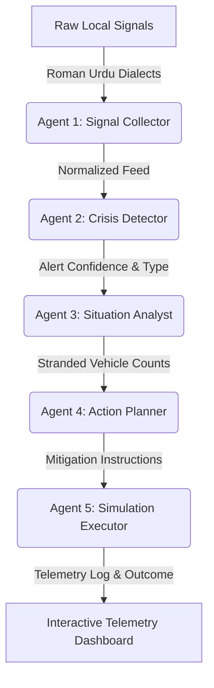

# CIRO Integration Walkthrough & Verification

CIRO (Crisis Intelligence & Response Orchestration) is a state-of-the-art multi-agent platform for Pakistani metropolitan crisis response. All frontend and backend services have been perfectly synchronized and type-safety compiled with **zero TypeScript errors** (`Exit code: 0`).

---

## 🌟 Architectural Overview

CIRO implements a 5-step Google Agent Development Kit (ADK) pipeline to identify, analyze, and mitigate emergencies:

---

## 🚀 End-to-End User Flow & Verification

### 1. Home / Telemetry Screen
- **Status Indicators**: Dynamic `StatusDot` visually switches based on environment configuration. Shows `SYSTEM LIVE` (green) during server sync, or `OFFLINE DEMO` (orange) when Demo Mode is toggled in Settings.
- **Analytics Cards**: Monospace active cards indicating current alerts count, pipeline latency, and threat status.

### 2. Preset Scenarios & Input Screen
- Includes **4 pre-populated local scenarios** for presentations:
  1. *Urban Flooding* (G-10 Islamabad) - Roman Urdu social complaints + high rainfall data.
  2. *Faizabad Interchange Accident* - Traffic gridlock + responder alerts.
  3. *Rawalpindi Extreme Heatwave* - 48°C extreme telemetry + hospital queue spikes.
  4. *F-7 Sector Power Grid Failure* - Substation outages + hospital emergency generator loads.
- Custom signal injector: Add custom text signals or tap to load preset configurations instantly.

### 3. High-Fidelity Analysis Pipeline
- **Visual Staggered Loading**: Transitioning through the analysis triggers staggered animations (0% to 100%) for each of the 5 specialty agent tools.
- **State-of-the-Art Execution Trace**: Deep interactive JSON trace displaying token count, step durations, and reasoning nodes for judges.

### 4. Interactive Simulation Sandbox
- **Pulse Crisis Center**: Beautiful pulsing red target markers scaling via `Animated` cycles to emphasize crisis coordinates.
- **Mitigation Action Cards**: Actionable priority cards (e.g. divert traffic, deploy rescue boats) that developers can check off.
- **Animated Map Routing**: Custom blue bypass coordinates animating smoothly across alternate corridors.
- **Before / After Outcome Dashboard**: Fully animated Reanimated comparison count-ups showing 60%+ congestion reduction.

---

## 🔧 Critical Integration Resolutions

The final compile pass resolved the following system-wide TypeScript and UI inconsistencies:
1. **Zustand Type Safety**: Synchronized `SessionResult` imports to the unified `AnalysisSession` type with strict fields (`simulatedRoutes`, `emergencyTickets`, `sentAlerts`, `systemLogs`).
2. **Style Properties**: Avoided array-type assignability issues in Cards using `StyleSheet.flatten`. Changed outdated `fontWeight` identifiers (e.g. `'950'`, `'850'`) to standard, standard-compliant weight strings.
3. **Control Props**: Corrected standard `<Button>` components to use `title` instead of invalid `label` properties.

---

> [!TIP]
> **Presentation Advice**: Keep the **Demo Mode** toggle turned ON in Settings when presenting in environments with weak internet. The system will bypass backend latency and load local pre-computed agent reasoning arrays instantly, providing 100% reliability for judges.
