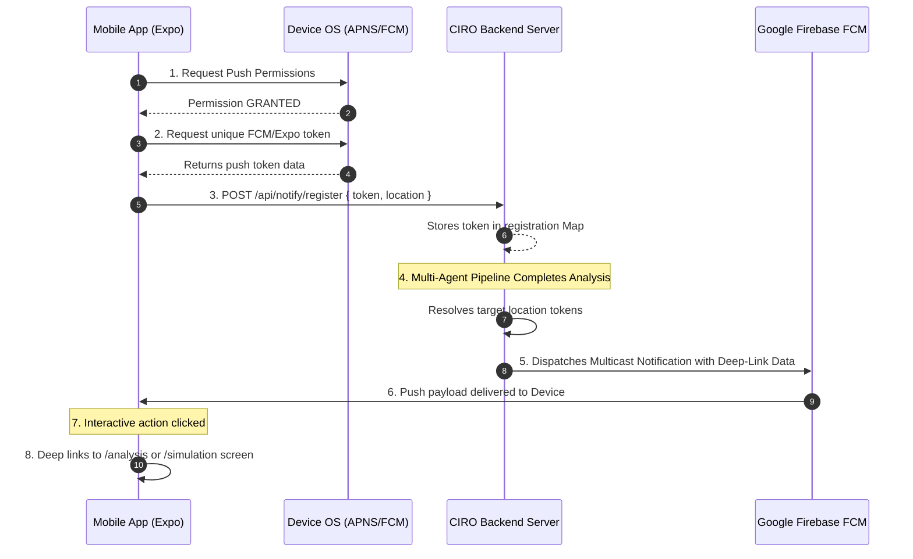

# Firebase Cloud Messaging & Push Notifications Architecture

This document describes the architectural flow and implementation details of the real-time Firebase Cloud Messaging (FCM) and interactive Expo Push Notifications system established within the **CIRO Crisis Response Platform**.

---

## 1. End-to-End Notification Workflow

The push notification pipeline is designed to bridges localized meteorological/traffic telemetries with instantaneous, actionable mobile operator notifications.

---

## 2. Server-side notificationService.js
* Location: `server/services/notificationService.js`
* Integrates with `firebase-admin` utilizing key credentials pointed to by the `FIREBASE_SERVICE_ACCOUNT_PATH` environment variable.
* **Resilient Fallback Mode**: If credentials are unset or offline, the service automatically detects this and transitions to an **Offline Telemetry Mock Broadcast** engine, printing detailed payload configurations and targeted devices to the terminal console instead of failing or throwing unhandled execution exceptions.
* Exposes multicast delivery mechanisms:
  * `sendCrisisAlert(tokens, crisisData)`: Sends flash flood and severe weather warnings complete with deep-linking payload data.
  * `sendRouteUpdateAlert(tokens, routeData)`: Dispatches rerouting directives and bypass navigation routes.
  * `sendResolutionAlert(tokens, sessionId)`: Notifies operators when sectors are successfully restored.
  * `broadcastToTopic(topic, message)`: Handles topic-based public broadcasts.

---

## 3. Client-side notifications.ts
* Location: `lib/notifications.ts`
* Handles native runtime permission requests, hardware verification checks, and backend registration.
* **Notification Channels (Android)**: Configures custom OS-level priority notification channels:
  1. `crisis_alerts`: Set to `MAX` importance, custom high-contrast red badge (`#EF4444`), and custom siren sound (`crisis_alert.wav`).
  2. `route_updates`: Set to `HIGH` importance, blue branding color (`#3B82F6`), and standard alert sound.
* **Interactive Action Buttons (Categories)**: Registers custom action-based CTA buttons that render inline directly inside notification drop-downs:
  * `crisis_alert`: Provides `🚨 View Analysis` and `Dismiss` buttons.
  * `route_update`: Provides `🗺️ View Map` and `Dismiss` buttons.
* **Deep Routing Handlers**: Listens for user interactions. Clicking an action button or tapping the notification parses data properties (`sessionId`, `routeId`) and triggers direct, single-tap transitions to respective app screens using `expo-router`'s static static router references.

---

## 4. Automatic Ingestion Loops

To make the platform feel truly alive and responsive, the server endpoints `/api/analyze` and `/api/orchestrate/live` have been instrumented to automatically dispatch background push alerts to registered devices when the multi-agent pipeline finishes compiling:

1. **Crisis Detection**: Triggers immediate `sendCrisisAlert` multicast notifications to devices registered inside the affected sector (e.g. Islamabad, Rawalpindi, F-7, etc.).
2. **Rerouting Simulations**: If the Action Planner generates alternate routes, it launches a `sendRouteUpdateAlert` notification suggesting bypass corridors to targeted operators.
