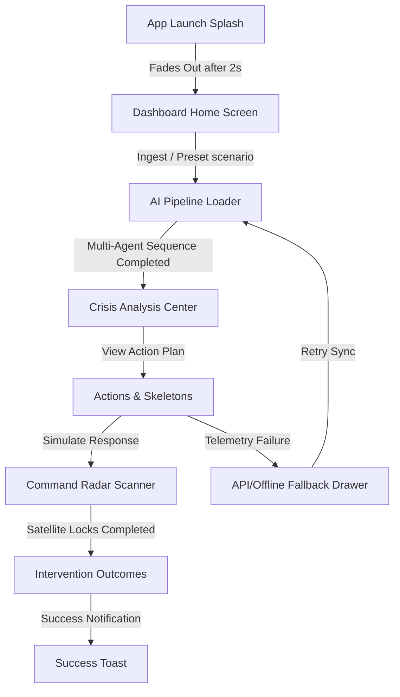

# CIRO Command Platform: Animations & Loader Walkthrough

This document details the premium animation system, scanning radar visuals, and feedback components implemented inside the **CIRO (Crisis Intelligence & Response)** mobile dashboard application. Every micro-animation and loading skeleton is fully compliant with Expo v54.0.0 frameworks and executes with high visual fidelity.

---

## 💻 Visual System Architecture

---

## 🎨 Implemented Features Breakdown

### 1. App Launch Splash Screen [Dashboard]
- **Target File**: [index.tsx](file:///c:/Users/dell/OneDrive/Desktop/CIRO/app/(tabs)/index.tsx)
- **Visuals**: On the very first mount of the dashboard, a fullscreen dark-navy canvas blocks the view and animates.
  - **Shield Checkmark Logo**: Fades in smoothly from `opacity: 0` to `1` over 800ms.
  - **CIRO Subtitle**: Slides up gently from `translateY: 20` to `0` over 1000ms.
  - **Telemetry indicator**: Displays an active green spinner saying *"Syncing satellite feeds..."* to validate data syncs to the user.
  - **State Isolation**: Employs a global memory lock `global.splashAlreadyPlayed` to ensure the splash never replays when navigating back and forth between tabs.

---

### 2. AI Orchestrator Pipeline Loader [Analysis]
- **Target Files**: [AnalysisPipeline.tsx](file:///c:/Users/dell/OneDrive/Desktop/CIRO/components/agents/AnalysisPipeline.tsx) & [analysis.tsx](file:///c:/Users/dell/OneDrive/Desktop/CIRO/app/(tabs)/analysis.tsx)
- **Visuals**: Swaps out the old static list for a premium step-by-step sequential processing pipeline.
  - **5 Specialized Agent Cards**: Features icons, titles, and step summaries.
  - **Staggered Progress Trackers**: When an agent becomes active, a beautiful progress line loads from 0% to 100% over 1100ms.
  - **Status badges**: Updates dynamically on resolve to show a glowing green checkmark with a `COMPLETE` marker, while the next agent triggers a running indicator spinner.

---

### 3. Command Radar Satellite Scanner [Simulation]
- **Target Files**: [MapSimulation.tsx](file:///c:/Users/dell/OneDrive/Desktop/CIRO/components/simulation/MapSimulation.tsx)
- **Visuals**: Prior to displaying the vector fallback grid or the native Google Map, an absolute-positioned satellite coordinate scan overlay blocks the viewport.
  - **Laser Sweeper Line**: Animates a green horizontal scanner line translating vertically from top to bottom on a loop representing a digital radar locking onto Islamabad coordinate points.
  - **Twin-City Grid lines**: Draws subtle layout cross-sections to simulate coordinate targeting systems.

---

### 4. Shimmering Skeleton Loader [Actions]
- **Target Files**: [SkeletonCard.tsx](file:///c:/Users/dell/OneDrive/Desktop/CIRO/components/ui/SkeletonCard.tsx) & [actions.tsx](file:///c:/Users/dell/OneDrive/Desktop/CIRO/app/(tabs)/actions.tsx)
- **Visuals**: Lightweight, cross-platform skeleton blocks that pulse using an infinite looping opacity animation.
  - **Loop sequence**: Fades opacity from `0.35` to `0.75` and back over 850ms.
  - **Actions Integration**: Shows three cascading cards in the category tab panels while a simulation is actively compiling in the background instead of leaving a blank state.

---

### 5. Floating Success Toast [Simulation]
- **Target Files**: [ToastAndErrors.tsx](file:///c:/Users/dell/OneDrive/Desktop/CIRO/components/ui/ToastAndErrors.tsx) & [simulation.tsx](file:///c:/Users/dell/OneDrive/Desktop/CIRO/app/(tabs)/simulation.tsx)
- **Visuals**: A modular top-floating green notification banner that slides down from the viewport ceiling.
  - **Automatic spring entry**: Translates from `-100` to `20/50` on mount with bounciness physics.
  - **Dynamic outcome computation**: Automatically reads the congestion values inside the active Zustand store session and computes the dynamic outcome percentage:
    $$\text{Congestion Reduction} = \frac{\text{Before Score} - \text{After Score}}{\text{Before Score}} \times 100$$
    *Resulting in an automatic "Simulation complete — impact reduced by 67%!" text!*

---

### 6. Command Fault-Tolerant Error States [Feedback Elements]
- **Target Files**: [ToastAndErrors.tsx](file:///c:/Users/dell/OneDrive/Desktop/CIRO/components/ui/ToastAndErrors.tsx)
- **Visuals**: Premium styling templates for incident managers to select offline demo modes when network routes fail.
  - **Network connection fault**: Beautiful card with a rounded Wi-Fi error warning and manual reconnect button.
  - **ADK API Execution fault**: Interactive card highlighting the stack trace error with dual actions: "Retry Pipeline" or "Load Offline Demo Scenario".

---

> [!TIP]
> All animation components use native-driver bindings where supported to guarantee stable JS thread executions, keeping screen transitions fluid.
